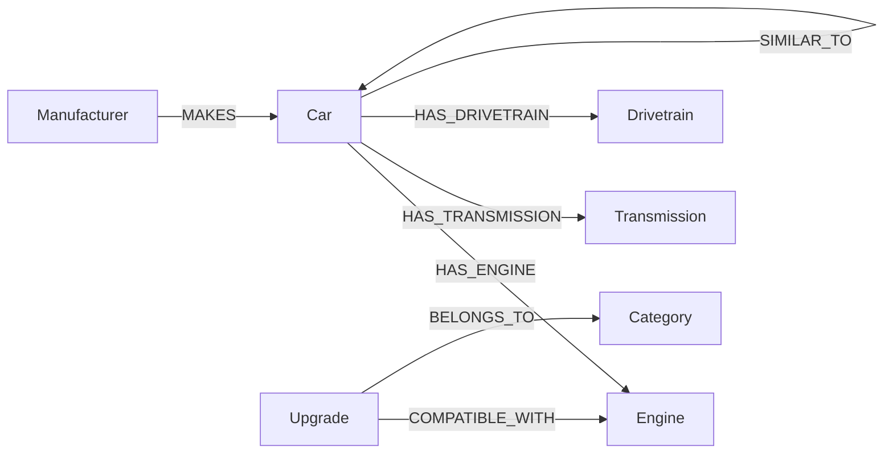

# AutoGraph — Smart Car Knowledge & Compatibility Explorer

A full-stack web application for exploring how cars, engines, transmissions,
drivetrains, and performance upgrades relate to one another — modeled and
queried as a **graph**, not a set of relational tables.

Built on **CognoDB**, a graph database that speaks the Bolt protocol and is
fully compatible with the official **Neo4j Python driver**.

---

## Table of contents

1. [Project overview](#project-overview)
2. [Why a graph database?](#why-a-graph-database)
3. [Architecture](#architecture)
4. [Graph data model](#graph-data-model)
5. [Folder structure](#folder-structure)
6. [Setup instructions](#setup-instructions)
7. [Environment variables](#environment-variables)
8. [Running locally](#running-locally)
9. [Seeding the database](#seeding-the-database)
10. [Cypher queries explained](#cypher-queries-explained)
11. [API reference](#api-reference)
12. [Deployment](#deployment)
13. [Screenshots](#screenshots)

---

## Project overview

AutoGraph lets a user browse a catalog of 30 performance cars from 10
manufacturers, drill into a car's full specification (engine, transmission,
drivetrain), see which aftermarket **upgrades** are compatible with its
engine, which cars are considered **similar**, and which cars share the same
**engine family** — even across manufacturers (e.g. the Toyota GR Supra and
BMW M340i both run a BMW B58 engine).

None of these are simple single-table lookups. They are graph traversals,
and that's the point of the project: to demonstrate where a graph database
naturally outperforms a relational one.

## Why a graph database?

The domain is relationship-heavy by nature: a car *has* an engine, an
engine *powers* several cars, an upgrade *fits* an engine, and cars are
*similar to* other cars. In a relational database, every one of the
"discovery" features this app offers — shared engine families, upgrade
compatibility, similarity, cross-manufacturer relationships — requires
multiple JOINs across junction tables, and the JOIN cost grows with every
extra hop.

In a graph database:

- **Relationships are first-class, not foreign keys.** `HAS_ENGINE`,
  `COMPATIBLE_WITH`, and `SIMILAR_TO` are stored as direct pointers between
  nodes, so traversing them is a constant-time pointer-chase rather than an
  index lookup plus join.
- **Multi-hop queries stay simple.** "Which cars share this car's engine
  family" is a 2-hop pattern match (`Car → Engine ← Car`) expressed in a
  few lines of Cypher — see query #2 below. The equivalent SQL needs a
  self-join through an engine table and gets harder to read with every
  additional hop.
- **The schema mirrors the mental model.** Manufacturers make cars, cars
  have parts, upgrades fit engines — the Cypher reads like the domain
  itself, which keeps the query layer close to how a product manager or
  engineer would describe the feature.
- **Recommendations are naturally graph-shaped.** "Recommend cars sharing
  drivetrain *and* engine family" is a weighted multi-hop traversal (query
  #5 below) that would require several relational JOINs plus a scoring
  subquery to replicate.

## Architecture

```
┌───────────────────────┐        HTTPS/JSON        ┌────────────────────────┐        Bolt         ┌──────────────┐
│  React + Vite SPA      │ ─────────────────────────▶│   Flask REST API       │ ────────────────────▶│   CognoDB     │
│  (Vercel)               │◀─────────────────────────│   (Render)              │◀──────────────────────│ (Neo4j-       │
│  Tailwind CSS UI        │                           │  Blueprints → Services  │                       │  compatible)  │
└───────────────────────┘                           │  → Repositories         │                       └──────────────┘
                                                       └────────────────────────┘
```

The backend follows a strict three-layer separation:

- **Blueprints** (`app/blueprints/`) — thin HTTP controllers. Parse the
  request, call a service, return JSON.
- **Services** (`app/services/`) — application logic. Combine repository
  calls, shape the response payload.
- **Repositories** (`app/repositories/`) — the only place Cypher lives.
  Each method maps to one purposeful graph query.

This keeps Cypher out of the HTTP layer entirely, so query logic can be
tested, reused, and reasoned about independently of Flask.

## Graph data model



**Node properties**

| Node | Key properties |
|---|---|
| `Manufacturer` | `slug`, `name`, `country`, `founded` |
| `Car` | `slug`, `name`, `year`, `horsepower`, `torque`, `bodyType` |
| `Engine` | `slug`, `name`, `family`, `cylinders`, `displacement`, `aspiration`, `horsepower` |
| `Transmission` | `slug`, `name`, `type`, `gears` |
| `Drivetrain` | `slug`, `name` |
| `Upgrade` | `slug`, `name`, `description`, `priceEstimate` |
| `Category` | `slug`, `name` |

The `Engine.family` property (e.g. `B58`, `FA`, `9A2`, `K20`) is what
enables the "shared engine family" queries — several distinct `Engine`
nodes can belong to the same family (e.g. `FA24` naturally-aspirated vs.
`FA24DIT` turbocharged both belong to family `FA`), modeling real-world
platform sharing without collapsing distinct tunes into a single node.

## Folder structure

```
autograph/
├── backend/
│   ├── app/
│   │   ├── __init__.py            # Flask app factory, error handlers
│   │   ├── config.py              # env-driven configuration
│   │   ├── extensions.py          # Neo4j/CognoDB driver singleton
│   │   ├── blueprints/            # HTTP layer
│   │   │   ├── cars.py
│   │   │   ├── manufacturers.py
│   │   │   ├── upgrades.py
│   │   │   ├── search.py
│   │   │   └── meta.py
│   │   ├── services/               # application logic
│   │   │   ├── car_service.py
│   │   │   ├── manufacturer_service.py
│   │   │   └── upgrade_service.py
│   │   └── repositories/           # Cypher lives here, only here
│   │       ├── base.py
│   │       ├── car_repository.py
│   │       ├── manufacturer_repository.py
│   │       └── upgrade_repository.py
│   ├── database.py                 # connectivity check + constraints
│   ├── seed.py                     # seed script (idempotent, MERGE-based)
│   ├── seed_data.py                # raw seed dataset
│   ├── wsgi.py                     # Flask/gunicorn entry point
│   ├── requirements.txt
│   ├── render.yaml                 # Render deployment config
│   └── .env.example
├── frontend/
│   ├── src/
│   │   ├── api/client.js           # typed fetch wrapper around the API
│   │   ├── components/             # Navbar, SearchBar, CarCard, RelationshipGraph...
│   │   ├── pages/                  # Home, CarDetail, ManufacturerDetail, UpgradeExplorer
│   │   ├── App.jsx
│   │   ├── main.jsx
│   │   └── index.css
│   ├── index.html
│   ├── package.json
│   ├── tailwind.config.js
│   ├── postcss.config.js
│   ├── vite.config.js
│   ├── vercel.json
│   └── .env.example
├── .gitignore
└── README.md
```

## Setup instructions

**Prerequisites:** Python 3.11+, Node.js 18+, a running CognoDB (or any
Bolt-compatible Neo4j instance — a free [Neo4j Aura](https://neo4j.com/cloud/aura/)
instance works too, since CognoDB is driver-compatible).

The **only** values you need to change are `GRAPH_URI`, `GRAPH_USER`, and
`GRAPH_PASSWORD` in `backend/.env`.

## Environment variables

**`backend/.env`** (copy from `backend/.env.example`):

| Variable | Description | Example |
|---|---|---|
| `GRAPH_URI` | Bolt connection URI for CognoDB | `neo4j+s://xxxx.databases.cogno.io` |
| `GRAPH_USER` | Database username | `neo4j` |
| `GRAPH_PASSWORD` | Database password | `••••••••` |
| `PORT` | Port Flask listens on | `5000` |
| `CORS_ORIGINS` | Comma-separated allowed origins | `http://localhost:5173` |

**`frontend/.env`** (copy from `frontend/.env.example`):

| Variable | Description | Example |
|---|---|---|
| `VITE_API_URL` | Base URL of the Flask API, including `/api` | `http://localhost:5000/api` |

## Running locally

```bash
# 1. Backend
cd backend
cp .env.example .env        # fill in GRAPH_URI / GRAPH_USER / GRAPH_PASSWORD
python -m venv .venv && source .venv/bin/activate
pip install -r requirements.txt
python database.py          # verifies connectivity, applies constraints
python seed.py                # loads manufacturers, cars, engines, upgrades...
python wsgi.py                 # starts the API on http://localhost:5000

# 2. Frontend (in a second terminal)
cd frontend
cp .env.example .env         # defaults already point at localhost:5000
npm install
npm run dev                   # starts the SPA on http://localhost:5173
```

Visit `http://localhost:5173`.

## Seeding the database

```bash
cd backend
python seed.py              # idempotent — safe to re-run, uses MERGE
python seed.py --reset      # wipes the graph first, then reseeds from scratch
```

`seed.py` loads, in order: manufacturers → engines → transmissions →
drivetrains → categories → cars (with `MAKES` / `HAS_ENGINE` /
`HAS_TRANSMISSION` / `HAS_DRIVETRAIN` edges) → upgrades (with
`BELONGS_TO` / `COMPATIBLE_WITH` edges) → `SIMILAR_TO` edges between cars.

Seed volume: **10 manufacturers, 30 cars, 20 engines, 20 transmissions,
3 drivetrains, 5 upgrade categories, 25 upgrades, 17 similarity edges.**

## Cypher queries explained

All queries live in `backend/app/repositories/`.

#### 1. Full car detail (single traversal, five relationship types)

```cypher
MATCH (m:Manufacturer)-[:MAKES]->(c:Car {slug: $slug})
OPTIONAL MATCH (c)-[:HAS_ENGINE]->(e:Engine)
OPTIONAL MATCH (c)-[:HAS_TRANSMISSION]->(t:Transmission)
OPTIONAL MATCH (c)-[:HAS_DRIVETRAIN]->(d:Drivetrain)
OPTIONAL MATCH (c)-[:SIMILAR_TO]->(sim:Car)<-[:MAKES]-(simM:Manufacturer)
OPTIONAL MATCH (up:Upgrade)-[:COMPATIBLE_WITH]->(e)
OPTIONAL MATCH (up)-[:BELONGS_TO]->(cat:Category)
RETURN c, m, e, t, d,
       collect(DISTINCT sim) AS similarCars,
       collect(DISTINCT up)  AS upgrades
```
Pulls a car's manufacturer, engine, transmission, drivetrain, similar cars,
and every compatible upgrade (with category) in one round trip.

#### 2. Shared engine family (2-hop traversal)

```cypher
MATCH (c:Car {slug: $slug})-[:HAS_ENGINE]->(e:Engine)
MATCH (other:Car)-[:HAS_ENGINE]->(e2:Engine)
WHERE other.slug <> $slug AND e2.family = e.family
MATCH (om:Manufacturer)-[:MAKES]->(other)
RETURN DISTINCT other, om.name AS manufacturer, e2.family AS engineFamily
```
Finds every other car — including from *different* manufacturers — whose
engine belongs to the same family. This is the query that surfaces, for
example, that the Toyota GR Supra and BMW M340i are engine-siblings.

#### 3. Manufacturer relationships (2-hop, cross-entity)

```cypher
MATCH (m:Manufacturer {slug: $slug})-[:MAKES]->(:Car)-[:HAS_ENGINE]->(e:Engine)
MATCH (otherM:Manufacturer)-[:MAKES]->(:Car)-[:HAS_ENGINE]->(e)
WHERE otherM.slug <> $slug
RETURN DISTINCT otherM, collect(DISTINCT e.family) AS sharedEngineFamilies
```
Two manufacturers are "related" if any of their cars share the exact same
`Engine` node — this is how the app surfaces that Toyota and BMW are
connected (via the shared B58 engine on the GR Supra and M340i/Z4).

#### 4. Compatible upgrades

```cypher
MATCH (u:Upgrade)-[:BELONGS_TO]->(cat:Category)
WHERE $category IS NULL OR toLower(cat.slug) = toLower($category)
OPTIONAL MATCH (u)-[:COMPATIBLE_WITH]->(e:Engine)
RETURN u, cat.name AS category, collect(DISTINCT e.name) AS compatibleEngines
```

#### 5. Recommendation (multi-hop, weighted traversal)

```cypher
MATCH (c:Car {slug: $slug})-[:HAS_DRIVETRAIN]->(d:Drivetrain)
MATCH (c)-[:HAS_ENGINE]->(e:Engine)
MATCH (other:Car)-[:HAS_DRIVETRAIN]->(d)
MATCH (other)-[:HAS_ENGINE]->(e2:Engine)
WHERE other.slug <> $slug
WITH other, e, e2, (CASE WHEN e2.family = e.family THEN 1 ELSE 0 END) AS engineMatch
MATCH (om:Manufacturer)-[:MAKES]->(other)
RETURN other, om.name AS manufacturer, engineMatch
ORDER BY engineMatch DESC, other.horsepower DESC
LIMIT $limit
```
Ranks candidate cars higher when they share **both** drivetrain and engine
family, falling back to drivetrain-only matches sorted by horsepower — a
simple but real graph-based recommendation.

#### 6. Free-text search

```cypher
MATCH (m:Manufacturer)-[:MAKES]->(c:Car)
WHERE toLower(c.name) CONTAINS toLower($term)
   OR toLower(m.name) CONTAINS toLower($term)
RETURN c, m.name AS manufacturer
LIMIT $limit
```

## API reference

| Method | Path | Description |
|---|---|---|
| GET | `/api/health` | Graph connectivity check |
| GET | `/api/cars` | List all cars |
| GET | `/api/cars/recent` | 6 most recent cars |
| GET | `/api/cars/:slug` | Full car detail + upgrades + similar + family + recommended |
| GET | `/api/manufacturers` | List all manufacturers |
| GET | `/api/manufacturers/popular` | Manufacturers ranked by car count |
| GET | `/api/manufacturers/:slug` | Manufacturer detail: cars, engines, related manufacturers |
| GET | `/api/upgrades?category=` | List upgrades, optionally filtered by category |
| GET | `/api/upgrades/categories` | List categories with upgrade counts |
| GET | `/api/search?q=` | Search cars by name or manufacturer |

## Deployment

### Backend → Render

1. Push this repo to GitHub.
2. In Render, create a **new Blueprint** from the repo (it will pick up
   `backend/render.yaml`), or manually create a Web Service with:
   - Root directory: `backend`
   - Build command: `pip install -r requirements.txt`
   - Start command: `gunicorn wsgi:app --bind 0.0.0.0:$PORT`
3. Set `GRAPH_URI`, `GRAPH_USER`, `GRAPH_PASSWORD`, and `CORS_ORIGINS`
   (your Vercel URL, once known) in the Render dashboard's environment
   variables.
4. Once live, run `python seed.py` once against the production database
   (locally, pointed at the production `GRAPH_URI`, or via a Render shell).

### Frontend → Vercel

1. Import the repo into Vercel.
2. Set the project root to `frontend`.
3. Set the environment variable `VITE_API_URL` to your Render backend URL
   plus `/api` (e.g. `https://autograph-api.onrender.com/api`).
4. Deploy — Vercel auto-detects the Vite build (`npm run build`, output
   `dist/`); `vercel.json` handles SPA routing fallbacks.

## Screenshots

> Replace with real screenshots after running the app locally.

| Home | Car detail | Upgrade explorer |
|---|---|---|
| `docs/screenshots/home.png` | `docs/screenshots/car-detail.png` | `docs/screenshots/upgrades.png` |
